# pix2pix — Cityscapes Image Translation

This repository contains my implementation of **pix2pix image-to-image translation** using the Cityscapes dataset, translating segmentation maps into realistic street photos.

This was done as part of a university lab assignment exploring conditional Generative Adversarial Networks (cGANs).

---

## Base Repository

This project builds on the TensorFlow implementation of pix2pix by Christopher Hesse:

> https://github.com/affinelayer/pix2pix-tensorflow

---

## Setup

### 1. Clone the repository

```bash
git clone https://github.com/affinelayer/pix2pix-tensorflow
cd pix2pix-tensorflow
```

### 2. Create and activate a virtual environment

```bash
~/.pyenv/versions/3.10.12/bin/python -m venv ~/pix2pix-venv
source ~/pix2pix-venv/bin/activate
```

### 3. Install TensorFlow for Apple Silicon

```bash
pip install --upgrade pip
pip install tensorflow-macos==2.12.0
pip install tensorflow-metal==0.8.0
```

### 4. Download the Cityscapes dataset

```bash
python tools/download-dataset.py cityscapes
```

---

## Training

Due to hardware constraints (MacBook Air M1, 8GB RAM, no fan), training was done on a **1,000 image subset** of the full 2,975 image dataset for **18 epochs**. This took approximately **3 hours** on Apple Silicon with Metal GPU acceleration.

Full training (2,975 images, 200 epochs) would take an estimated **35+ hours** on the same hardware.

```bash
# Create 1k subset
mkdir -p cityscapes_small/train
ls cityscapes/train | head -1000 | xargs -I {} cp cityscapes/train/{} cityscapes_small/train/


python pix2pix.py \
  --mode train \
  --output_dir cityscapes_train \
  --max_epochs 18 \
  --input_dir cityscapes_small/train \
  --which_direction BtoA
```

---

## Testing

### On the official Cityscapes validation set (500 images):

```bash
python pix2pix.py \
  --mode test \
  --output_dir cityscapes_test \
  --input_dir cityscapes/val \
  --checkpoint cityscapes_train
```

### On 5 personal photos:

```bash
python pix2pix.py \
  --mode test \
  --output_dir my_photos/results \
  --input_dir my_photos/combined \
  --checkpoint cityscapes_train
```

---

## Results

### Scores

| Test Set                    | L1 Score | Notes                                               |
| --------------------------- | -------- | --------------------------------------------------- |
| Cityscapes val (500 images) | 0.1416   | 3x worse than paper (~0.05) due to reduced training |
| Personal photos (5 images)  | 0.3087   | High score due to domain mismatch                   |

The gap from the paper benchmark is directly attributable to computational constraints — 33% of training data and 9% of recommended epochs — rather than architectural issues.

The high L1 score on personal photos demonstrates a key pix2pix limitation: **the model cannot generalize beyond its training domain**.

---

## Cityscapes Validation Results (sample)

Each row shows: **input segmentation map | generated photo | real photo**

### Sample 1

| Input                                    | Output                                    | Target                                    |
| ---------------------------------------- | ----------------------------------------- | ----------------------------------------- |
| 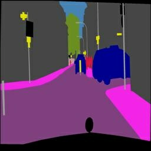 | 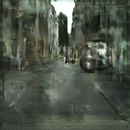 | 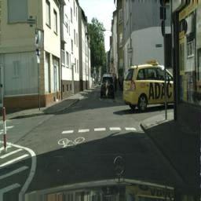 |

### Sample 2

| Input                                     | Output                                     | Target                                     |
| ----------------------------------------- | ------------------------------------------ | ------------------------------------------ |
| 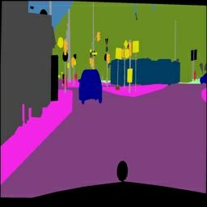 | 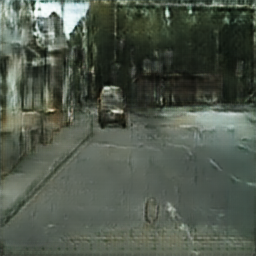 | 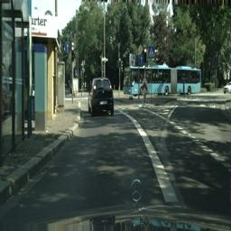 |

### Sample 3

| Input                                      | Output                                      | Target                                      |
| ------------------------------------------ | ------------------------------------------- | ------------------------------------------- |
| 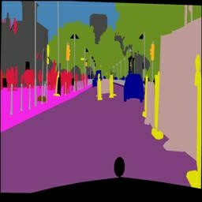 | 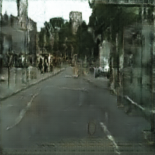 | 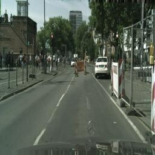 |

### Sample 4

| Input                                      | Output                                      | Target                                      |
| ------------------------------------------ | ------------------------------------------- | ------------------------------------------- |
| 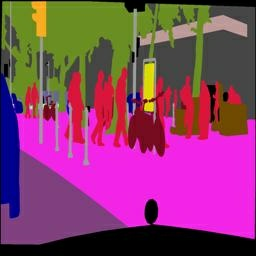 | 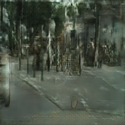 | 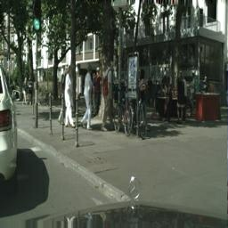 |

### Sample 5

| Input                                      | Output                                      | Target                                      |
| ------------------------------------------ | ------------------------------------------- | ------------------------------------------- |
| 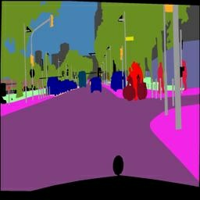 | 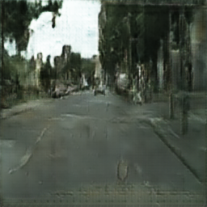 | 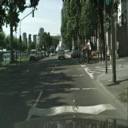 |

---

## Personal Photo Results

Each row shows: **input (segmented) | generated output | original photo**

### Photo 1

| Input                                             | Output                                             | Target                                             |
| ------------------------------------------------- | -------------------------------------------------- | -------------------------------------------------- |
| 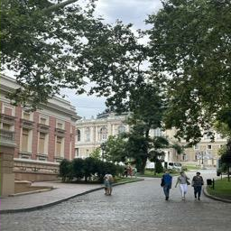 | 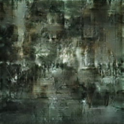 | 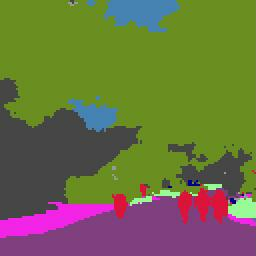 |

### Photo 2

| Input                                             | Output                                             | Target                                             |
| ------------------------------------------------- | -------------------------------------------------- | -------------------------------------------------- |
| 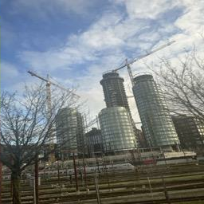 | 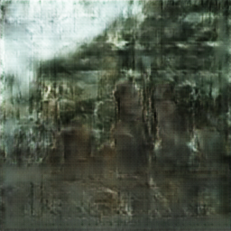 | 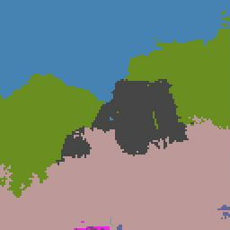 |

### Photo 3

| Input                                             | Output                                             | Target                                             |
| ------------------------------------------------- | -------------------------------------------------- | -------------------------------------------------- |
| 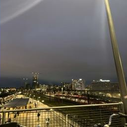 | 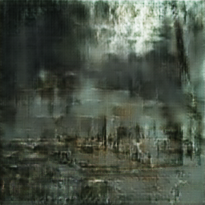 | 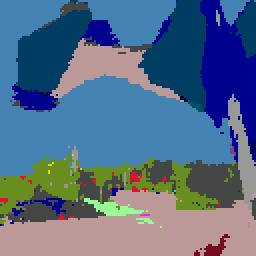 |

### Photo 4

| Input                                             | Output                                             | Target                                             |
| ------------------------------------------------- | -------------------------------------------------- | -------------------------------------------------- |
| 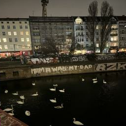 | 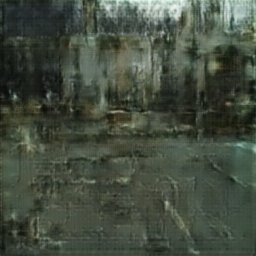 | 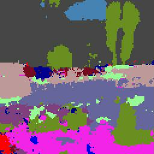 |

### Photo 5

| Input                                             | Output                                             | Target                                             |
| ------------------------------------------------- | -------------------------------------------------- | -------------------------------------------------- |
| 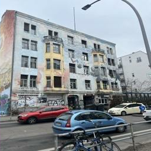 | 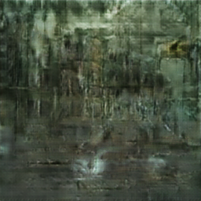 | 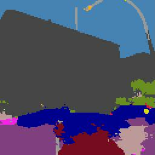 |

---

## Reference

> Image-to-Image Translation with Conditional Adversarial Networks  
> Phillip Isola, Jun-Yan Zhu, Tinghui Zhou, Alexei A. Efros  
> CVPR 2017  
> https://arxiv.org/abs/1611.07004
